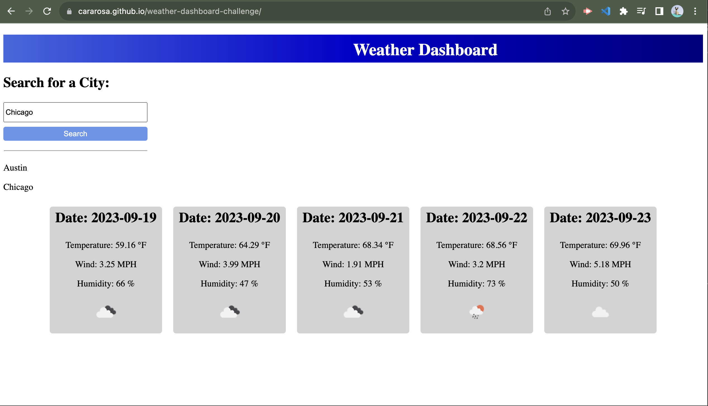

# Weather Dashboard Webpage

## Description

The Weather Dashboard Webpage is designed for users to have an overview of a five day weather forecast for multiple cities. Users can search for a city and receive back a weather report for the specified city. The weather report consists of the current date, the next five dates, the temperatures for all five days, the wind speeds for all five days, and the humidity for all five days. After a user searches for the desired city, the city name is saved and displayed to the screen in order to allow the user to see the search history.

The Weather Dashboard is created with the use of HTML, CSS, and JavaScript. The data for the five day weather forecast is retrieved from the OpenWeather API.

## Installation

No installation is needed for this webpage. This is the link to the deployed application: [Link](https://cararosa.github.io/weather-dashboard-challenge/)
Below is the screenshot of the webpage in my browser window:

## Credits

My tutor was able to assist me in accessing the OpenWeather API correctly. In addition, he helped me in narrowing down the number of days that would be displayed. To display the 5 day forecast, he said I could target the same timestamp for each day (ie. noon). This code can be found in the folder assets within the subfolder js under file name display-weather.js. He was also able to point out that I needed to link my JS file. This code can be found in search-results.html. The tutor noted that I declared my API key twice. At his reccomendation, I deleted one of the declarations. This code was deleted from display-weather.js. My instructor and a TA were able to assist me when my application did not work after I deployed it to GitHub. This code can be found in index.html.

## License

An MIT License is applied to this work. Please refer to the licence in the repository for further details.